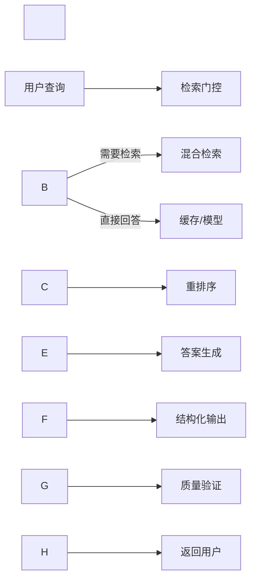

\# RAG监控洞察平台 产品需求文档（PRD）


\## 1. 产品概述


\### 1.1 产品定位

RAG监控洞察平台是一个企业级智能文档监控与问答系统，通过持续监控企业内外部文档变化，提供实时洞察和精准问答服务，帮助企业快速获取关键信息变更和做出决策。


\### 1.2 核心价值主张

\- \*\*从被动查询到主动洞察\*\*：不再是简单的问答机器人，而是7×24小时的智能监控助手

\- \*\*可审计的信任体系\*\*：每个答案都有据可查，提供完整的引用链路

\- \*\*极致的成本效益\*\*：通过智能门控和缓存策略，将运营成本降低80%

\- \*\*可量化的商业价值\*\*：提供明确的ROI指标和效果追踪


\### 1.3 目标用户

\- \*\*主要用户\*\*：企业合规部门、法务部门、市场研究部门、产品管理团队

\- \*\*次要用户\*\*：技术文档管理团队、客户支持团队、销售团队


\## 2. 功能需求


\### 2.1 核心功能模块


\#### 2.1.1 智能检索门控系统


\*\*功能描述\*\*：智能判断是否需要进行文档检索，避免不必要的资源消耗。


\*\*详细需求\*\*：

```yaml

判断流程:

&nbsp; 1. 语义不确定性检测:

&nbsp;    - 对用户查询进行3-5种paraphrase

&nbsp;    - 计算回答的语义离散度

&nbsp;    - 阈值: 离散度 > 0.7 触发检索

&nbsp; 

&nbsp; 2. 关键词触发检测:

&nbsp;    - 维护企业专有术语库

&nbsp;    - 包含: 产品SKU、政策代码、项目代号

&nbsp;    - 匹配即触发检索

&nbsp; 

&nbsp; 3. 可回答性分类:

&nbsp;    - 轻量级分类器判断

&nbsp;    - 输出: 可直接回答/需要检索/无法回答

```


\*\*验收标准\*\*：

\- 减少60%不必要的检索调用

\- 响应延迟降低到< 500ms（简单问题）


\#### 2.1.2 混合检索与重排序引擎


\*\*功能描述\*\*：结合多种检索策略，提供最精准的文档召回。


\*\*技术架构\*\*：

```yaml

检索流程:

&nbsp; 第一层 - 候选召回:

&nbsp;   - BM25: 召回30-50个文档

&nbsp;   - Vector Search: 召回50-100个文档

&nbsp;   - 合并去重

&nbsp; 

&nbsp; 第二层 - 精准重排:

&nbsp;   - Cross-encoder重排序

&nbsp;   - 输出Top 5-8个最相关文档

&nbsp; 

文档处理:

&nbsp; 分块策略:

&nbsp;   - 块大小: 200-400 tokens

&nbsp;   - 重叠: 20-40 tokens

&nbsp;   - 保留: 唯一ID + 字节偏移量

```


\*\*验收标准\*\*：

\- 检索准确率 > 85%

\- P@5 (Precision at 5) > 0.8


\#### 2.1.3 结构化答案生成系统


\*\*功能描述\*\*：生成带有完整引用的结构化答案，建立信任体系。


\*\*输出格式\*\*：

```json

{

&nbsp; "answer": "具体答案文本",

&nbsp; "confidence": 0.95,

&nbsp; "citations": \[

&nbsp;   {

&nbsp;     "doc\_id": "DOC\_001",

&nbsp;     "source\_url": "https://...",

&nbsp;     "excerpt": "引用的原文片段",

&nbsp;     "byte\_offset": \[1024, 1280],

&nbsp;     "relevance\_score": 0.92

&nbsp;   }

&nbsp; ],

&nbsp; "metadata": {

&nbsp;   "retrieval\_time\_ms": 230,

&nbsp;   "model\_used": "gpt-4",

&nbsp;   "timestamp": "2024-01-15T10:30:00Z"

&nbsp; },

&nbsp; "low\_confidence\_reason": null

}

```


\*\*验收标准\*\*：

\- 100% JSON Schema验证通过率

\- 引用准确率 > 95%


\#### 2.1.4 智能监控与增量洞察


\*\*功能描述\*\*：主动监控文档变化，推送关键洞察。


\*\*监控能力\*\*：

```yaml

数据源:

&nbsp; - 内部文档库（Google Drive, SharePoint）

&nbsp; - 外部RSS订阅

&nbsp; - API数据源

&nbsp; - 网页监控


监控规则:

&nbsp; - 实体变化追踪（公司、产品、政策）

&nbsp; - 阈值告警（数值变化超过设定）

&nbsp; - 情感变化检测

&nbsp; - 关键词触发


推送机制:

&nbsp; - 每日摘要（仅变化内容）

&nbsp; - 实时告警（关键变化）

&nbsp; - 周报月报（趋势分析）

```


\*\*验收标准\*\*：

\- 变更捕获率 > 90%

\- 误报率 < 5%


\#### 2.1.5 幻觉控制与质量保障


\*\*功能描述\*\*：多层次防护机制，确保答案可靠性。


\*\*控制机制\*\*：

```yaml

预防层:

&nbsp; - 可回答性预判断

&nbsp; - 必须引用清单（价格、法规、安全信息）

&nbsp; 

验证层:

&nbsp; - 少数投票机制（3次生成，语义一致性检查）

&nbsp; - 引用验证（检查引用内容是否支持结论）

&nbsp; 

补救层:

&nbsp; - 主动弃权（不确定时明确告知）

&nbsp; - 人工审核队列

```


\### 2.2 性能优化功能


\#### 2.2.1 智能缓存系统


\*\*多级缓存策略\*\*：

```yaml

L1 - 查询缓存:

&nbsp; - 标准化查询哈希

&nbsp; - TTL: 24-72小时

&nbsp; - 命中率目标: > 40%


L2 - 检索结果缓存:

&nbsp; - 文档ID + 排序结果

&nbsp; - TTL: 7天

&nbsp; - 空间限制: 10GB


L3 - 嵌入向量缓存:

&nbsp; - 常用文档预计算

&nbsp; - 更新策略: 增量更新

```


\#### 2.2.2 成本控制中心


\*\*成本监控与优化\*\*：

```yaml

监控维度:

&nbsp; - API调用次数/成本

&nbsp; - 存储使用量

&nbsp; - 计算资源消耗

&nbsp; 

优化策略:

&nbsp; - 摘要压缩（3-5要点）

&nbsp; - 批量处理

&nbsp; - 离峰调度

```


\## 3. 非功能需求


\### 3.1 性能要求

\- \*\*响应时间\*\*：简单查询 < 500ms，复杂查询 < 3s

\- \*\*并发支持\*\*：支持 1000 QPS

\- \*\*可用性\*\*：99.9% uptime SLA


\### 3.2 安全与合规

\- \*\*数据隔离\*\*：多租户完全隔离

\- \*\*审计日志\*\*：完整的操作审计链

\- \*\*权限控制\*\*：细粒度的文档访问控制

\- \*\*合规认证\*\*：SOC2, GDPR合规


\### 3.3 可扩展性

\- \*\*水平扩展\*\*：支持按需扩容

\- \*\*插件架构\*\*：支持自定义数据源接入

\- \*\*API开放\*\*：提供完整的REST API


\## 4. 商业模式


\### 4.1 定价策略


```yaml

基础版 - $199/月:

&nbsp; - 10个监控实体

&nbsp; - 1000次查询/月

&nbsp; - 5个用户席位

&nbsp; 

专业版 - $999/月:

&nbsp; - 100个监控实体

&nbsp; - 10000次查询/月

&nbsp; - 20个用户席位

&nbsp; - API访问

&nbsp; 

企业版 - 定制价格:

&nbsp; - 无限监控实体

&nbsp; - 无限查询

&nbsp; - 无限席位

&nbsp; - 私有部署选项

&nbsp; - SLA保障

```


\### 4.2 增值服务

\- \*\*定制化模型训练\*\*：$5000/次

\- \*\*专属客户成功经理\*\*：$500/月

\- \*\*合规审计报告\*\*：$1000/季度


\## 5. 关键指标（KPIs）


\### 5.1 产品指标

```yaml

质量指标:

&nbsp; - 引用答案率: > 95%

&nbsp; - 首次正确回答率: > 85%

&nbsp; - 弃权准确率: > 90%

&nbsp; 

效率指标:

&nbsp; - 平均响应时间: < 2s

&nbsp; - 缓存命中率: > 40%

&nbsp; - API成本节省: > 60%

&nbsp; 

业务指标:

&nbsp; - 月活跃用户增长: 20%

&nbsp; - 客户留存率: > 85%

&nbsp; - NPS分数: > 50

```


\### 5.2 监控仪表板

\- 实时查询量与响应时间

\- 每日/周/月成本趋势

\- 用户满意度追踪

\- 系统健康状态


\## 6. 技术架构


\### 6.1 技术栈

```yaml

后端:

&nbsp; - Python FastAPI (主服务)

&nbsp; - Elasticsearch (关键词检索)

&nbsp; - Qdrant/Weaviate (向量数据库)

&nbsp; - Redis (缓存层)

&nbsp; - PostgreSQL (元数据存储)

&nbsp; 

前端:

&nbsp; - React + TypeScript

&nbsp; - Material-UI

&nbsp; - WebSocket (实时推送)

&nbsp; 

基础设施:

&nbsp; - Kubernetes (容器编排)

&nbsp; - AWS/Azure (云平台)

&nbsp; - Prometheus + Grafana (监控)

```


\### 6.2 数据流架构




\## 7. 实施路线图


\### Phase 1: MVP (2个月)

\- ✅ 基础检索功能

\- ✅ 简单问答系统

\- ✅ JSON结构化输出

\- ✅ 基础缓存


\### Phase 2: 增强版 (2个月)

\- ⏳ 检索门控系统

\- ⏳ 混合检索优化

\- ⏳ 监控功能原型

\- ⏳ 幻觉控制机制


\### Phase 3: 商业版 (2个月)

\- ⏳ 完整监控平台

\- ⏳ 多租户支持

\- ⏳ 计费系统

\- ⏳ 企业级安全


\### Phase 4: 规模化 (持续)

\- ⏳ 性能优化

\- ⏳ 垂直行业定制

\- ⏳ 生态系统构建


\## 8. 风险与缓解


```yaml

技术风险:

&nbsp; - 风险: 模型幻觉难以完全消除

&nbsp;   缓解: 多层验证机制 + 人工审核

&nbsp; 

&nbsp; - 风险: 检索延迟影响用户体验

&nbsp;   缓解: 智能缓存 + 异步处理

&nbsp; 

商业风险:

&nbsp; - 风险: 客户信任建立困难

&nbsp;   缓解: 透明的引用系统 + 免费试用

&nbsp; 

&nbsp; - 风险: 成本控制失败

&nbsp;   缓解: 严格的资源配额 + 实时监控

```


\## 9. 成功标准


\- \*\*3个月内\*\*：获得10个付费企业客户

\- \*\*6个月内\*\*：MRR达到 $50,000

\- \*\*12个月内\*\*：实现正向现金流

\- \*\*客户满意度\*\*：NPS > 50

\- \*\*技术指标\*\*：所有KPI达标


---


这份PRD将"技术实验"转化为"可商业化产品"，核心在于：

1\. \*\*价值导向\*\*：每个功能都与商业价值挂钩

2\. \*\*信任构建\*\*：通过结构化、可审计的输出建立信任

3\. \*\*成本控制\*\*：通过工程优化实现商业可行性

4\. \*\*产品化思维\*\*：从"RAG系统"到"监控洞察平台"的转变


下一步建议立即启动MVP开发，重点实现检索门控和结构化输出两个核心功能，快速验证市场反馈。

