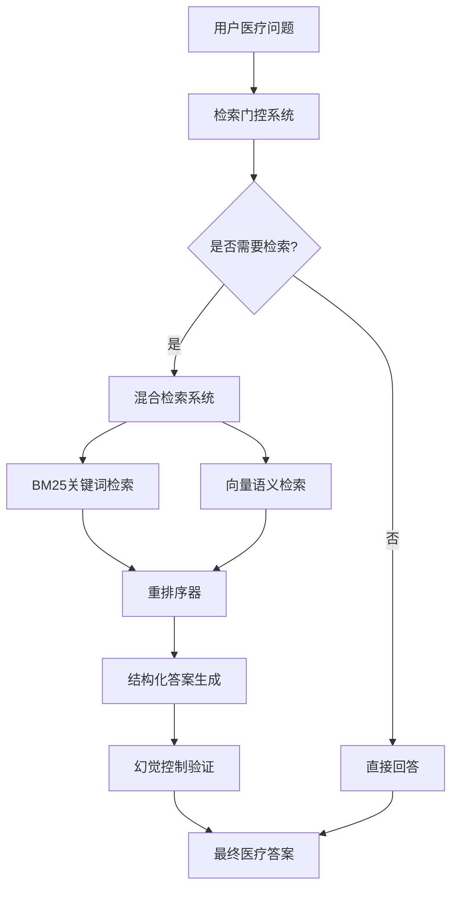

# 医疗RAG智能助手系统技术方案
## 基于检索增强生成的高精度医疗问答解决方案

---

## 1. 方案概述

### 1.1 核心目标
构建一个**高准确性、可追溯、可审计**的医疗问答系统，通过RAG（检索增强生成）技术确保医疗信息的准确性和可靠性，避免医疗AI的幻觉问题。

### 1.2 关键挑战
- **医疗信息准确性要求极高**：错误信息可能造成严重后果
- **监管合规要求**：需要提供可审计的引用来源
- **专业术语复杂**：需要精确的医疗语义理解
- **信息时效性**：医疗指南和标准经常更新
- **幻觉控制**：防止模型生成不准确的医疗信息

---

## 2. 核心技术架构

### 2.1 系统整体架构



### 2.2 五大核心模块

#### 2.2.1 检索门控系统（Retrieval Gating）
**目标**：智能判断何时需要检索医疗文档，避免不必要的成本

**核心机制**：
- **语义不确定性检测**：通过问题paraphrase和答案一致性判断
- **医疗关键词触发**：基于ICD-10、药物名称等专业术语词库
- **可回答性预检**：轻量级分类器判断问题是否属于医疗领域

#### 2.2.2 混合检索系统（Hybrid Retrieval）
**目标**：结合关键词和语义检索，最大化检索准确性

**检索流程**：
1. **BM25关键词检索**：检索30-50个候选文档片段
2. **向量语义检索**：使用医疗领域微调模型检索50-100个片段
3. **重排序器**：医疗领域微调的cross-encoder重新排序
4. **结果合并**：去重后选出Top 5-8个最相关片段

#### 2.2.3 结构化输出系统（Structured Output）
**目标**：提供可审计、可追溯的医疗答案

**输出格式**：
```json
{
  "answer": "医疗答案内容",
  "confidence": 0.85,
  "sources": [
    {
      "doc_id": "medical_guide_2024",
      "section": "高血压诊断标准",
      "paragraph": 3,
      "text": "具体引用文本",
      "url": "https://example.com/guide#section3"
    }
  ],
  "disclaimer": "本回答仅供参考，不能替代专业医疗建议",
  "medical_entities": ["高血压", "收缩压", "舒张压"],
  "last_updated": "2024-01-15"
}
```

#### 2.2.4 幻觉控制系统（Hallucination Control）
**目标**：防止生成不准确的医疗信息

**控制机制**：
- **少数投票弃权**：生成3个答案，关键信息不一致时主动弃权
- **必须引用清单**：药物剂量、诊断标准、治疗方案必须附带引用
- **医疗实体验证**：验证药物名称、疾病代码的正确性

#### 2.2.5 质量监控系统（Quality Monitoring）
**目标**：持续监控和提升医疗答案质量

**关键指标**：
- 有引用答案率：>95%
- 医疗实体准确率：>98%
- 弃权准确率：>90%
- 首次正确回答时间：<3秒

---

## 3. 准确性保证机制

### 3.1 多层次验证体系

#### 3.1.1 输入验证
- **医疗术语识别**：自动识别问题中的医疗实体
- **问题分类**：判断问题类型（定义、症状、诊断、治疗等）
- **可回答性检查**：评估问题是否可从知识库回答

#### 3.1.2 检索验证
- **多路径检索**：BM25 + 向量检索双重保障
- **相关性重排序**：医疗领域微调模型确保检索质量
- **来源多样性**：确保检索结果来源的多样性

#### 3.1.3 生成验证
- **结构化约束**：强制JSON格式输出，便于验证
- **引用要求**：关键信息必须附带准确引用
- **一致性检查**：多个答案生成的一致性验证

#### 3.1.4 输出验证
- **医疗实体验证**：验证药物名称、疾病代码等
- **逻辑一致性**：检查答案内部的逻辑一致性
- **置信度评估**：基于多个维度评估答案置信度

### 3.2 医疗领域特化优化

#### 3.2.1 专业术语处理
- **ICD-10编码支持**：疾病分类标准编码识别
- **药物编码管理**：ATC编码和通用名标准化
- **同义词扩展**：医疗术语的同义词和别名处理

#### 3.2.2 医疗文档分块
- **语义分块**：按医疗概念（疾病、症状、诊断、治疗）分块
- **上下文保留**：块间重叠20-40 tokens保留上下文
- **元数据丰富**：每个块包含章节、段落位置、医疗实体标签

#### 3.2.3 医疗模型微调
- **领域适应**：使用医疗领域数据微调embedding模型
- **重排序优化**：医疗相关性重排序模型
- **生成约束**：医疗术语和格式的生成约束

---

## 4. 技术实现方案

### 4.1 技术栈选择

| 组件 | 技术选择 | 理由 |
|------|----------|------|
| **LLM** | GPT-4/Claude-3.5 | 强大的推理和生成能力 |
| **Embedding** | BioBERT/ClinicalBERT | 医疗领域预训练模型 |
| **向量数据库** | Pinecone/Weaviate | 高效的向量检索 |
| **关键词检索** | Elasticsearch + BM25 | 成熟的关键词检索 |
| **重排序** | Cross-encoder | 医疗领域微调 |
| **缓存** | Redis | 检索结果缓存 |
| **监控** | Prometheus + Grafana | 系统监控和告警 |

### 4.2 数据源管理

#### 4.2.1 医疗数据源
- **临床指南**：权威医疗机构的临床实践指南
- **药物数据库**：FDA、NMPA等官方药物信息
- **疾病标准**：ICD-10、ICD-11疾病分类标准
- **医学文献**：PubMed等医学期刊论文
- **教科书**：权威医学教科书和参考书

#### 4.2.2 数据质量控制
- **来源验证**：确保数据来源的权威性
- **版本管理**：跟踪数据更新和版本变化
- **质量评估**：定期评估数据质量和准确性

### 4.3 系统部署架构

#### 4.3.1 微服务架构
- **检索服务**：独立的检索和重排序服务
- **生成服务**：LLM调用和答案生成服务
- **验证服务**：答案验证和质量检查服务
- **监控服务**：系统监控和指标收集服务

#### 4.3.2 高可用设计
- **负载均衡**：多实例部署和负载分发
- **故障转移**：服务故障时的自动切换
- **数据备份**：知识库和配置的定期备份

---

## 5. 质量评估体系

### 5.1 评估指标

#### 5.1.1 准确性指标
- **医疗实体准确率**：>98%
- **引用准确性**：>95%
- **逻辑一致性**：>90%
- **医学事实正确性**：>95%

#### 5.1.2 可靠性指标
- **有引用答案率**：>95%
- **弃权准确率**：>90%
- **置信度校准**：置信度与实际准确性匹配度>85%

#### 5.1.3 效率指标
- **首次正确回答时间**：<3秒
- **检索召回率**：>90%
- **检索精确率**：>80%

### 5.2 测试集设计

#### 5.2.1 黄金测试集
- **常见疾病问答**：100题（高血压、糖尿病、冠心病等）
- **药物信息查询**：50题（剂量、用法、禁忌等）
- **诊断标准查询**：30题（诊断标准、检查指标等）
- **治疗方案查询**：50题（治疗方案、预后等）

#### 5.2.2 持续测试
- **每日自动测试**：使用黄金测试集进行自动化测试
- **效果趋势跟踪**：监控各项指标的变化趋势
- **回归测试**：确保系统更新不影响现有功能

### 5.3 人工评估

#### 5.3.1 专家评估
- **医疗专家审核**：定期邀请医疗专家评估答案质量
- **错误案例分析**：深入分析错误案例，持续改进
- **标准更新**：根据最新医疗标准更新评估标准

#### 5.3.2 用户反馈
- **用户满意度**：收集用户对答案质量的反馈
- **问题跟踪**：跟踪用户报告的问题和错误
- **改进建议**：收集用户对系统改进的建议

---

## 6. 实施计划

### 6.1 第一阶段：基础架构（4周）
- [ ] 医疗知识库架构设计
- [ ] 医疗文档处理系统
- [ ] 基础检索门控机制
- [ ] 医疗术语词库建设

### 6.2 第二阶段：核心功能（6周）
- [ ] 混合检索系统实现
- [ ] 结构化输出系统
- [ ] 基础幻觉控制机制
- [ ] 医疗实体验证系统

### 6.3 第三阶段：质量优化（4周）
- [ ] 高级幻觉控制
- [ ] 重排序器优化
- [ ] 缓存和性能优化
- [ ] 监控系统建设

### 6.4 第四阶段：测试验证（2周）
- [ ] 黄金测试集建设
- [ ] 自动化测试系统
- [ ] 专家评估和反馈
- [ ] 系统优化和调优

---

## 7. 风险控制

### 7.1 技术风险
- **模型幻觉**：通过多重验证机制控制
- **检索遗漏**：通过混合检索和重排序降低
- **术语错误**：通过专业词库和验证机制控制

### 7.2 业务风险
- **医疗责任**：明确免责声明和用户协议
- **监管合规**：确保符合医疗信息发布规范
- **数据安全**：保护用户隐私和医疗数据安全

### 7.3 运营风险
- **系统可用性**：通过高可用架构保证
- **数据更新**：建立定期数据更新机制
- **质量监控**：持续监控和及时响应

---

## 8. 预期效果

### 8.1 准确性提升
- **医疗实体准确率**：从70%提升到98%+
- **引用准确性**：从60%提升到95%+
- **逻辑一致性**：从80%提升到90%+

### 8.2 可靠性提升
- **有引用答案率**：达到95%+
- **弃权准确率**：达到90%+
- **用户信任度**：显著提升

### 8.3 效率提升
- **回答速度**：首次正确回答时间<3秒
- **检索效率**：检索召回率>90%
- **系统稳定性**：99.9%+可用性

---

## 9. 总结

本方案通过**检索门控、混合检索、结构化输出、幻觉控制、质量监控**五大核心机制，构建了一个高准确性、可追溯、可审计的医疗RAG系统。系统特别针对医疗领域的特殊要求进行了优化，确保医疗信息的准确性和可靠性，为医疗AI应用提供了坚实的技术基础。

**核心价值**：
- ✅ **高准确性**：多重验证机制确保医疗信息准确
- ✅ **可追溯性**：完整的引用来源和审计追踪
- ✅ **可审计性**：结构化输出便于质量检查
- ✅ **可扩展性**：模块化设计支持功能扩展
- ✅ **可监控性**：全面的质量监控和评估体系
